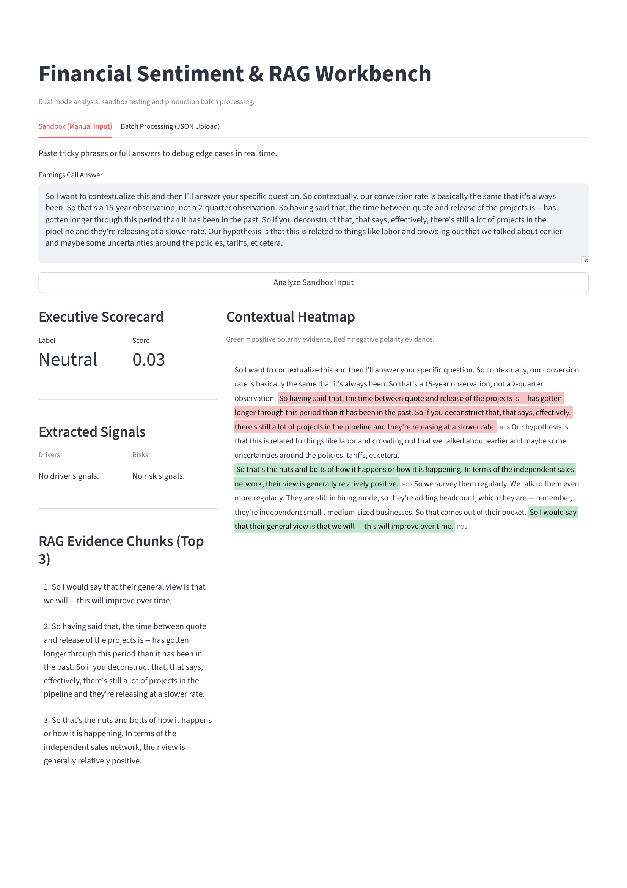
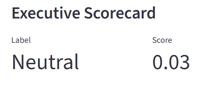
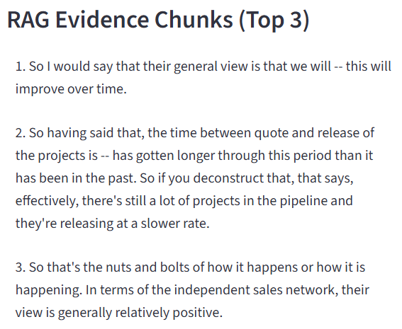
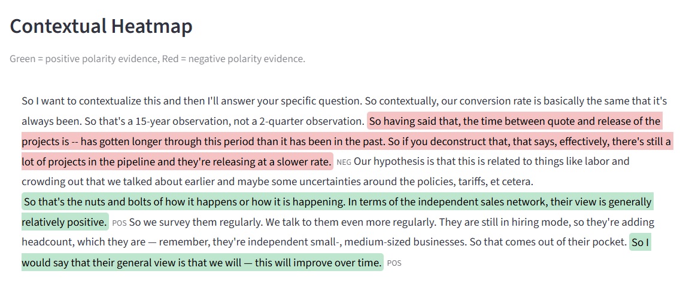

# Explainable Financial Sentiment Engine [](https://earnings-call-sentiment.streamlit.app)

An end-to-end NLP system that analyzes earnings call transcripts and provides **interpretable sentiment insights** using FinBERT and a **Retrieval-Augmented Generation (RAG)** pipeline.

---

## Key Features

-  **Context-aware sentiment analysis** using FinBERT
-  **RAG-based evidence retrieval** for explainability
-  **Sentiment-aligned ranking** of supporting text
-  **Drivers vs Risks extraction** for financial insights
-  **Contextual heatmap visualization** (highlighted evidence)
-  **Interactive Streamlit dashboard**
-  **Batch processing** for large-scale transcript analysis

---

## System Overview

This system goes beyond basic sentiment classification by combining:

1. **FinBERT-based sentiment scoring**
2. **Context window aggregation**
3. **Signal extraction (drivers & risks)**
4. **FAISS-based semantic retrieval (RAG)**
5. **Sentiment-aligned evidence ranking**

 Output includes:
- Sentiment label + score  
- Key drivers and risks  
- Supporting evidence (highlighted in text)

---

## Architecture
Transcript / Q&A
↓
Sentence Splitting
↓
Context Window Analysis (FinBERT)
↓
Signal Extraction (Drivers / Risks)
↓
RAG Retrieval (FAISS + embeddings)
↓
Sentiment-Aligned Ranking
↓
Final Output (Score + Evidence + Visualization)


---

## Demo (Streamlit UI)

### Features

- **Sandbox Mode** → Test individual answers  
- **Batch Mode** → Upload JSON and process full transcripts  
- **Executive Scorecard** → Sentiment + confidence  
- **Evidence Panel** → Top supporting chunks  
- **Contextual Heatmap** → Highlighted positive/negative text  

---

## Screenshots






---

## Tech Stack

- Python
- PyTorch
- Hugging Face Transformers
- FAISS (vector search)
- Sentence Transformers
- Streamlit

---

## Installation

```bash
git clone https://github.com/rohithvishwa31/earnings-call-sentiment.git
cd earnings-call-sentiment
pip install -r requirements.txt
```
---

## Run the app

```bash
python -m streamlit run pipeline/ui/app.py
```

---

## Input Format (Batch Mode)

```JSON
[
  {
    "question": "What drove growth this quarter?",
    "answer": "We saw strong demand across segments..."
  }
]
```

---

## Sample Output 

```JSON
{
  "label": "positive",
  "score": 0.38,
  "drivers": ["growth", "strong demand"],
  "evidence": [
    "we saw strong demand across segments",
    "growth will continue",
    "record revenue this quarter"
  ]
}
```

---

## Key Contributions
- Designed a sentiment-aware RAG pipeline for explainability
- Implemented polarity-aligned evidence ranking
- Built an interactive analytics dashboard
- Improved neutral sentiment handling and calibration

---

## Limitations
- Sentiment model may misclassify edge cases
- Evidence retrieval depends on chunking quality
- Not optimized for real-time large-scale deployment

--- 

## Future Improvements
- Hybrid retrieval (BM25 + embeddings)
- LLM-based summarization of insights
- Improved financial signal extraction
- Deployment as an API

## Motivation

Traditional sentiment models act as black boxes.
This project focuses on making financial NLP explainable and actionable by combining modeling with retrieval.

## Author

**Rohith Vishwa Saravanan**
Software Developer | ML Enthusiast
